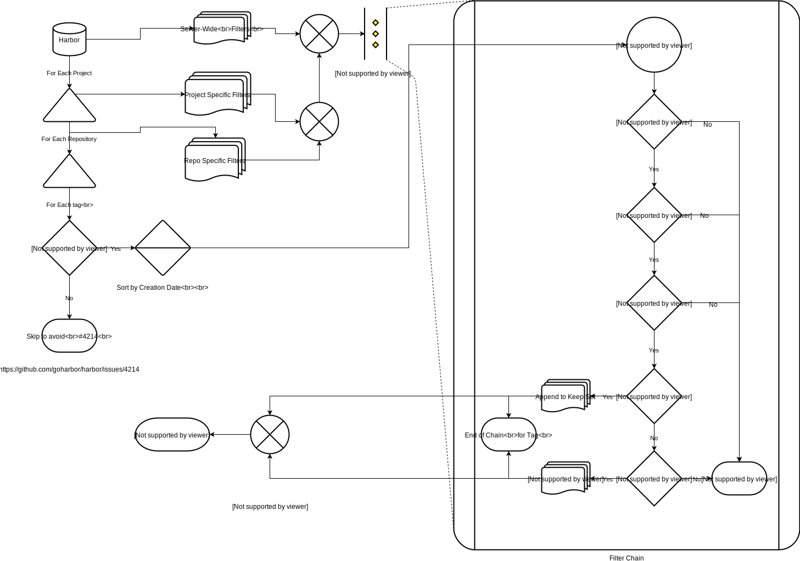

# Proposal: Tag Retention Policies

Author: Nathan Lowe

Last Updated: 2018-09-04

Discussion: [goharbor/harbor#5420](https://github.com/goharbor/harbor/issues/5420)

## Abstract

Provide an automated method of deleting tags from Harbor based on various rules,
which can be defined at the Server, Project, or Repository level. These rules
can be configured by Harbor Admins, or, if enabled, Project Admins.

## Background

Not many people have the luxury of unlimited storage. For images and tags that
are effectively ephemeral (like those built and tagged for use only by an
intermediate process in a CI pipeline) it does not make sense to keep these tags
around for an extended period of time, consuming precious resources. Other tags,
like those correlating to released or deployed software may need to be kept for
an extended period of time or even forever for various legal or compliance
reasons. While this is possible today via Harbor's API, Harbor Administrators
could greatly benefit from having this functionality built-in to harbor itself.

This seems to be a relatively popular issue in the community today:

* [goharbor/harbor#1168](https://github.com/goharbor/harbor/issues/1168) - 强烈建议增加定时删除清理镜像策略 (Google Translate: "It is strongly recommended to add a timed delete cleanup mirroring strategy.")
* [goharbor/harbor#4753](https://github.com/goharbor/harbor/issues/4753) - Can not automation clean old images and can not setup clean policy?
* [goharbor/harbor#5085](https://github.com/goharbor/harbor/issues/5085) - Harbor registry tag cleaner tool

A basic solution exists today as an out-of-tree project contributed by employees
of Hyland Software. For details on this existing solution, please see
[hylandsoftware/Harbor.Tagd](https://github.com/HylandSoftware/Harbor.Tagd).
This solution runs external to Harbor and only supports one type of rule:
"Always keep tags in this list: `[latest, a, b, ...]` and then keep the most
recent `x` tags." These rules cannot be configured from Harbor itself and
requires additional infrastructure to support and run the cleanup process.

## Proposal

I propose the following solution:

[](https://www.draw.io/?title=Tag%20Retention%20Process#Uhttps%3A%2F%2Fdrive.google.com%2Fuc%3Fid%3D116m9y_QvSDVOg1TC3g0H2jP9LJHvqMzk%26export%3Ddownload)

### Definitions

* `server`: An instance of `goharbor/harbor`
* `project`: A project in a `server`, a collection of `repositories`
* `repo` / `repository`: A repository in a `project`, a collection of `tag`s
* `tag`: A tag on a docker image
* `rule`: A retention rule
* `Filter Chain`: An ordered collection of `rule`s to apply to an ordered set of `tag`s

### Overview

At the heart of Tag Retention is the `Rule`. These can be something as simple as
"Keep Everything" to something as complex as "Delete all tags with any of these
labels: `[foo, bar, ...]` older than `x` days." Rules are tied together in a
`Filter Chain` in order of precedence. The filter chain is guaranteed to be
handed tags in descending order of tag creation, grouped by repo and then by
project. The filter chain may receive tags for any one of these projects, but
once a tag for a project has been received the chain will continue to receive
tags for that project (sorted by creation date descending) until no more tags
remain for that project. This enables the creation of filters that need to know
about the state of the while filter chain.

For example, If I have two projects and two repos in each project:

* `projectA/repo1`
* `projectA/repo3`
* `projectB/repo2`
* `projectB/repo4`

Let's say the filter chain receives tags for `projectB/repo2` first. It will
then receive ***all*** tags for `projectB/repo2` until no more tags remain for
that Project and Repository. The process repeats until there are no more
projects and repositories left to process.

### The Filter Chain

Rules can be composed to allow a complex expression of one or more Retention
Policies. Administrators may wish to enforce a default policy but allow the
policy to be tweaked at a per-project or per-repository level. Conversely,
Project Administrators may be fine with the default policy but decide it is
acceptable to keep fewer tags than what the default policy provides for. The
Filter Chain is composed of one or more Filters in order of precedence, and
always concludes with the filters that make up the default policy. A rough
interface may look like this:

```go
// Tag represents a tag on a project/repository combination
type Tag struct{
    image string
    name  string
    //...
}

// Filter is a tag filter in a Retention Policy Filter Chain
type Filter interface {
    // Process takes tags from the input channel and writes them to one of the three output channels.
    // Tags are written to toKeep if the tags should be explicitly kept by the Filter
    // Tags are written to toDelete if the tags should be explicitly deleted by the Filter
    // Tags are written to next if the retention policy does not apply to the provided tag
    //      or if the policy does not care if the tag is kept or deleted
    //
    // Filters do not own any of the provided channels and should **not** close them under any circumstance
    Process(input <-chan Tag, toKeep chan<- Tag, toDelete chan<- Tag, next chan<- Tag) error
}
```

When processing a tag, Filters can make one of three decisions:

1. Explicitly Keep the tag
2. Explicitly Delete the tag
3. Do Nothing with the tag

If a filter does nothing with the tag it is expected to pass it to the next
filter in the chain. Keeping or Deleting a tag will terminate the filter chain
for that tag; no further filters will be processed.

An example implementation of the only filter supported by
[hylandsoftware/Harbor.Tagd](https://github.com/HylandSoftware/Harbor.Tagd) may
look something like this:

```go
type KeepLatestXFilter struct{
    Threshold int

    counter map[string]int
}

func (f *KeepLatestXFilter) Process(input <-chan Tag, toKeep chan<- Tag, toDelete chan<- Tag, next chan<- Tag) error {
    for tag := range input {
        if !f.AppliesTo(tag) {
            next <- tag
            continue
        }

        f.counter[tag.image]++
        if f.counter[tag.image] > f.Threshold {
            toDelete <- tag
        } else {
            toKeep <- next
        }
    }
}

func (f *KeepLatestXFilter) AppliesTo(t Tag) bool {
    // TODO: Ensure filter applies to tag
    return true
}
```

While the filter chain is processing tags, all tags in the explicit keep and
explicit delete lists are accumulated. After all rules have finished processing
for all tags, the system checks to ensure that any tags in the delete list do
not have a tag with the same digest in the keep list. If it finds any such tags,
they are removed from the delete list, as harbor will delete all tags with the
same digest when a delete command is issued.

## Rationale

[A discussion of alternate approaches and the trade offs, advantages, and disadvantages of the specified approach.]

## Compatibility

[A discussion of the change with regard to the
[compatibility guidelines](https://golang.org/doc/go1compat).]

## Implementation

[A description of the steps in the implementation, who will do them, and when.
This should include a discussion of how the work fits into [Go's release cycle](https://golang.org/wiki/Go-Release-Cycle).]

## Open issues (if applicable)

[A discussion of issues relating to this proposal for which the author does not
know the solution. This section may be omitted if there are none.]